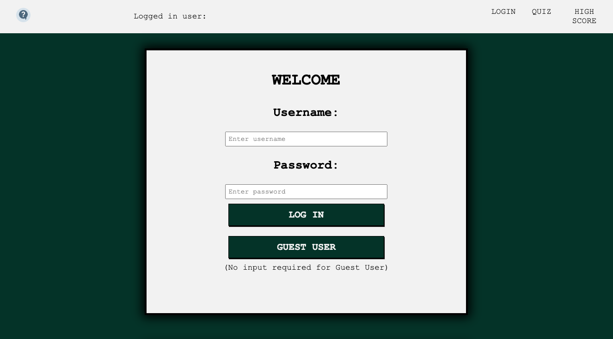
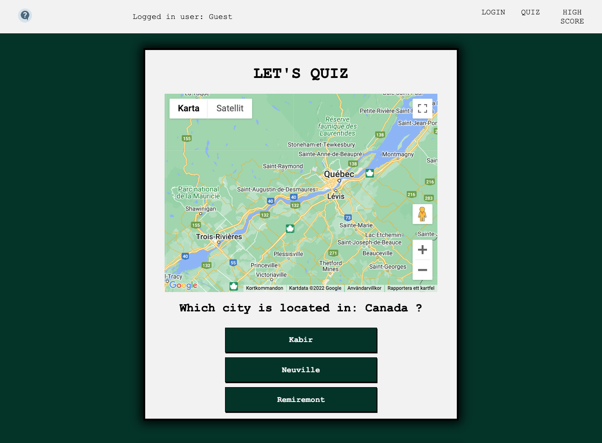
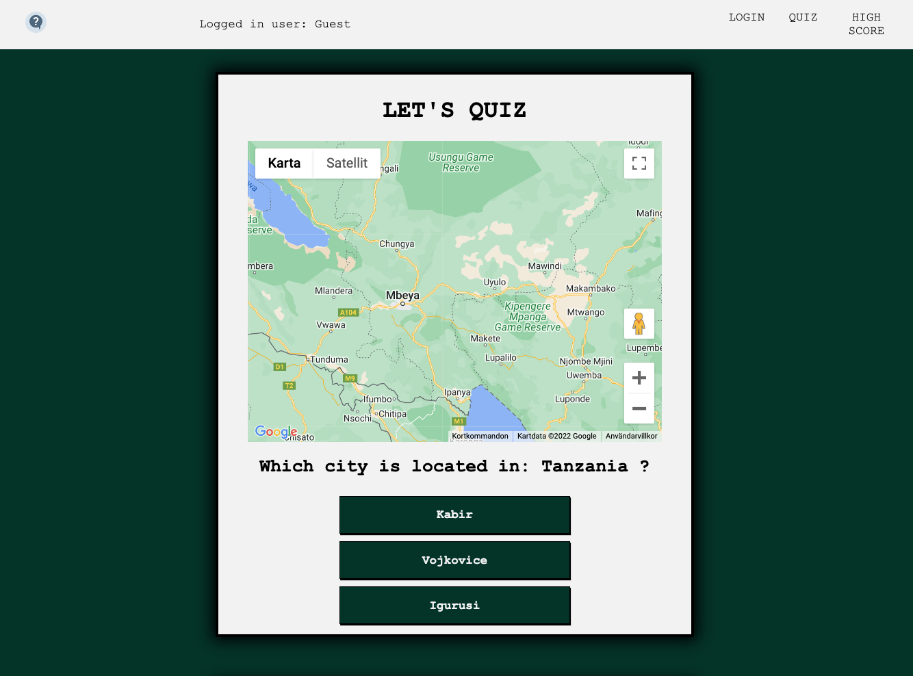
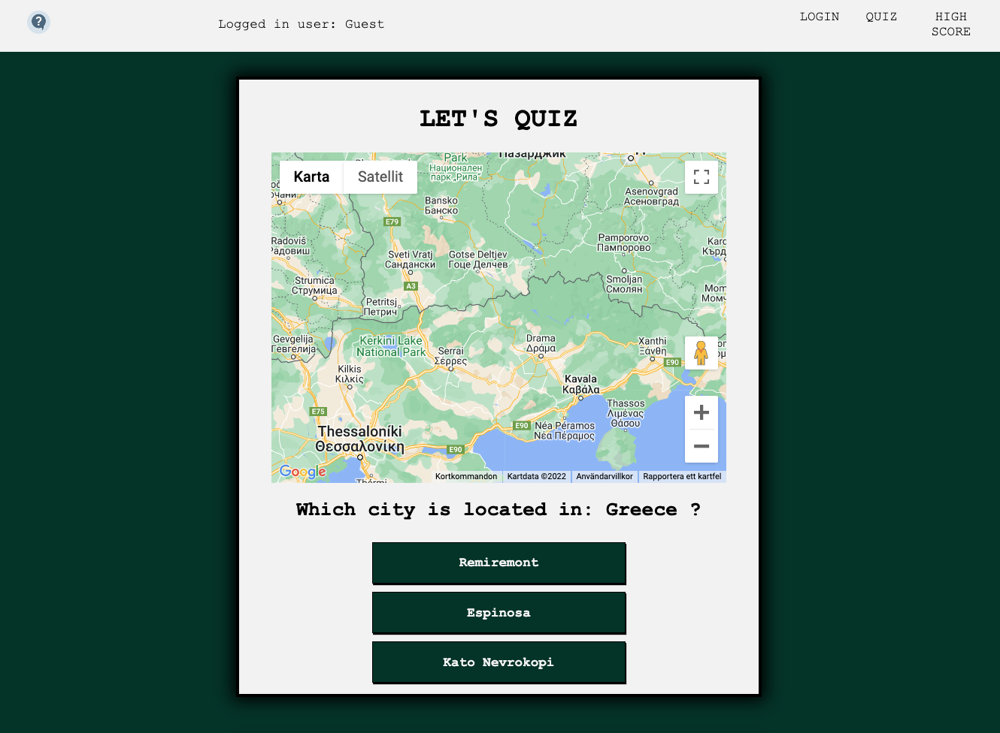
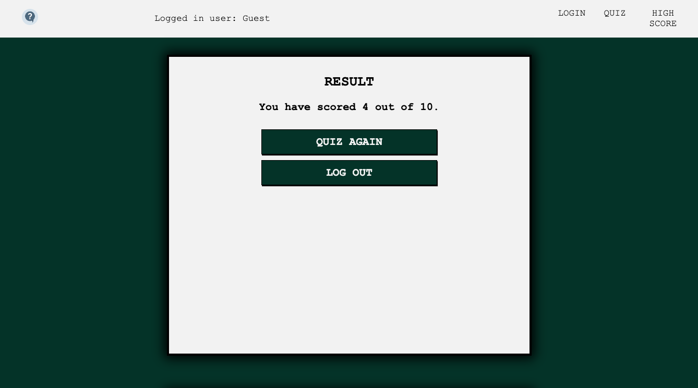

# Schoolproject "City Quiz"
React project using google-API and local DB. Backend written in C#. 

Application randoms one Country and three different city options. The user is supposed to guess which city that belongs to the country. If you need a clue you can hover over the blank page and map over the coutry where the city is located will be visualized. 

## The application
First you enter the Login View were you can access the Quiz either by log in with Username and Password or as a Guest User (Username and Password are stored in DB) If you choose Guest User neither Username or Password is requierd.
After you pressed Log In or Guest User you get redirected to the Quiz View and the quiz is started. After making guesses on 10 citys and countries the quiz is over. You are redirected to the HighScore View and your result is showed. Now your options are to Quiz Again or Log Out. 

## Instructions: 

## DB setup: 
Start container in Docker.
Login to Azure Data studio.
Open file named "cityQuizDBSetUp" which is located in SQLQueries folder. 
Run queries. 
If exequted correctly DB called cityQuizDB will be created containing three tables called: Users, HighScore and Question. 

## Googlemap API
To be able to use application you need an API-key from google maps since the app is using it to visualize the map. 
You can find instructions for creating your own API-key and read documentation here: https://cloud.google.com/docs/authentication/api-keys

## Left to do: 
- Mobile Navigation
- Profile View
- HighScore list
- Userinput for API-key 

